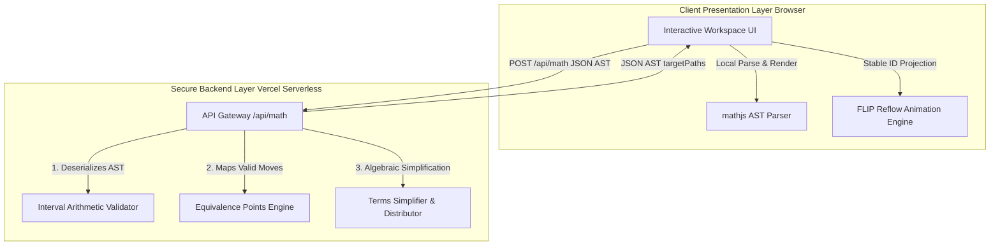

# 📐 Algebranch — Interactive Algebraic Derivation System

Algebranch is a premium, interactive mathematical derivation application built to demystify algebraic manipulations. Unlike traditional computer algebra systems that act as symbolic "black boxes" performing full simplifications automatically, Algebranch focuses on **transparent, step-by-step user-directed derivations**. 

It exposes the recursive tree structure of mathematical equations via an intuitive, glassmorphic layout where users click terms and physically relocate them, automatically calculating valid algebraic transpositions in real-time under a secure, serverless architecture.

---

## 🏗️ Project Architecture & Monorepo Structure

This project is organized as a high-performance monorepo split into two decoupled packages to isolate computational logic from the presentation layer:



*   **`/math-engine`**: A pure, portable, and zero-dependency TypeScript mathematical reasoning library. It contains the interval arithmetic evaluator, point-evaluation identity tester, algebraic simplification/distribution rules, and AST serializers.
*   **`/ui`**: A premium Next.js frontend application powered by Jotai atomic state management, custom curved SVG branching timeline canvases, and a JS-based nested FLIP layout transition reflow engine.

---

## 🔒 Vercel Serverless Security: IP Protection

To protect the secret, proprietary algebraic reasoning algorithms of the Algebranch engine, the application is deployed under a **full-stack client/server decoupling**:

1.  **Client-Safe Code Isolation**: The frontend uses standard compiler path mappings (`tsconfig.json`) to bind imports strictly to `ui/src/math-engine/client.ts`. This lightweight presentation module contains absolutely no proprietary algorithms, preventing static builders (Vercel/Webpack) from packing your intellectual property into client-side browser bundles.
2.  **API Gateway Routing**: All proprietary interval arithmetic evaluations, equivalence check points, and simplification matches run securely on the Vercel backend inside a secure Next.js Serverless Function API route (`/ui/src/app/api/math/route.ts`).
3.  **AST JSON Serialization**: The client and server exchange full AST structures as structured JSON objects (`SerializedEquation`). By passing the AST with client-side node IDs intact, the backend performs validations on the matching structure and returns target paths with stable IDs, preserving the premium **350ms FLIP transition reflows** across network boundaries!

---

## 🎓 The Nomenclature Framework

To ensure complete semantic consistency between the UI elements, Jotai state, and the core math engine, Algebranch defines a strict **Five-State Nomenclature**:

1.  **Active**: Clickable mathematical terms possessing valid algebraic moves in the current equation context.
2.  **Source**: The selected term undergoing transposition. (Maximum of one active source at a time).
3.  **Target**: Glowing emerald drop slots representing mathematically sound destination locations for the active **Source**.
4.  **Static**: Inert, non-interactive terms styled in opaque slate/gray to form the visual landscape of the equation.
5.  **Simplify**: Interactive amber dots representing constant folding (`13 - 5` $\rightarrow$ `8`), fraction simplification (`6 / 2` $\rightarrow$ `3`), redundant terms (`+ 0`, `* 1`, `(x) -> x`), or distribution matches (`2*(x + 3)` $\rightarrow$ `2*x + 6`).

---

## ⚙️ Quick Start: Running Locally

This repository uses **npm workspaces** to manage packages, compile dependencies, and run tests uniformly from the root directory.

### Prerequisites
Make sure you have Node.js (v18+) and npm installed.

### 1. Install All Dependencies
Install dependencies for the root, `/ui`, and `/math-engine` in a single command:
```bash
npm install
```

### 2. Start the Development Server
Launch the local Next.js development server:
```bash
npm run dev
```
The application will run locally at [http://localhost:3000](http://localhost:3000).

### 3. Run the Math-Engine Test Suite
Algebranch is strictly validated via automated unit testing. Run the 27 math-engine Jest tests:
```bash
npm run test
```

---

## 📐 Key Features

*   **Two-Click Interaction**: Select a term on click, and click any glowing green slot to transpose it standardly.
*   **Branching History Tree Timeline**: Track derivations on a DFS coordinate canvas showing S-curve bezier paths between chronological steps. You can click any step bubble to restore or branch.
*   **Automatic Parenthesis Stripping**: High-precision operator precedence utility that automatically cleans up redundant parentheses on transposition (e.g., `(x + 4) / 2 = 5` $\rightarrow$ `x + 4 = 5 * 2`) while strictly preserving necessary groupings.
*   **Algebraic Distribution Engine**: Expands complex terms recursively via yellow reduction dots (e.g., expanding and folding `2 * (x + 3)` to `2 * x + 6`).
*   **Interval Arithmetic Identity Validation**: Handwritten point evaluator plugging random coordinates into proposed states to assert equality under 10ms.
