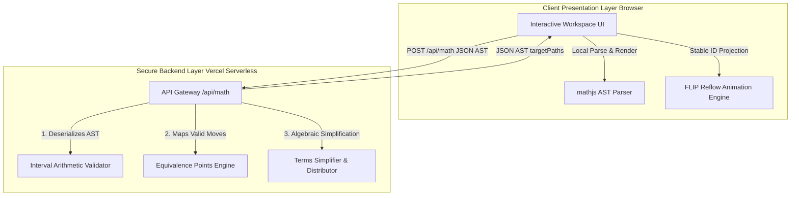

# 📐 Algebranch — Interactive Algebraic Derivation System

Algebranch is a premium, interactive mathematical derivation application built to demystify algebraic manipulations. Unlike traditional computer algebra systems that act as symbolic "black boxes" performing full simplifications automatically, Algebranch focuses on **transparent, step-by-step user-directed derivations**. 

It exposes the recursive tree structure of mathematical equations via an intuitive, glassmorphic layout where users click terms and physically relocate them, automatically calculating valid algebraic transpositions in real-time under a secure, serverless architecture.

---

## 🏗️ Project Architecture & Monorepo Structure

This project is organized as a high-performance monorepo split into two decoupled packages to isolate computational logic from the presentation layer:



*   **`/math-engine`**: A pure, portable, and zero-dependency TypeScript mathematical reasoning library. It contains the interval arithmetic evaluator, point-evaluation identity tester, algebraic simplification/distribution rules, and AST serializers.
*   **`/ui`**: A premium Next.js frontend application powered by Jotai atomic state management, custom curved SVG branching timeline canvases, and a JS-based nested FLIP layout transition reflow engine.

> For the authoritative architecture — data representation, validation mechanism, and the execution boundary — see **[SPEC.md §2–§5](SPEC.md)**.

---

## 🔒 Serverless IP Protection

To keep the proprietary algebraic reasoning algorithms off the browser, all solving and validation run server-side: the client posts the serialized AST (`SerializedEquation`) to a Next.js serverless route (`POST /api/math`) and renders the candidate/target/reducible paths it returns. Node IDs are preserved across the boundary so the 350ms FLIP reflows stay stable.

> **[SPEC.md §4.3 (Deployment & Execution Boundary)](SPEC.md) is the canonical description** of the client/server split, the `math-engine-client` path alias, and which engine functions run where. This section is a summary.

---

## 🎓 The Nomenclature Framework

Algebranch defines a strict **five-state nomenclature** for every node in the expression tree, kept consistent across UI elements, Jotai state, and the core math engine. **[SPEC.md §8 (Nomenclature Framework)](SPEC.md) is the canonical definition**; the state names, semantics, and `THEME_GLASS` token names below are a summary that must match it exactly:

1.  **Candidate (Movable)** (`THEME_GLASS.CARD_CANDIDATE_SCAN`): Interactive terms that can be repositioned to another node in the AST (tracked client-side by `candidatePathsAtom`).
2.  **Source** (`THEME_GLASS.SOURCE`): The single selected Candidate currently undergoing transposition (at most one at a time).
3.  **Target (Destination)** (`THEME_GLASS.TARGET`): Emerald drop slots representing mathematically sound destinations for the active **Source**.
4.  **Static (Inert)** (`THEME_GLASS.STATIC`): Inert, non-interactive terms forming the stable visual landscape of the equation.
5.  **Simplify / Reducible (Transformable)** (`THEME_GLASS.CARD_CANDIDATE_SCAN`): Nodes offering constant folding (`13 - 5` $\rightarrow$ `8`), fraction simplification (`6 / 2` $\rightarrow$ `3`), redundant-term removal (`+ 0`, `* 1`, `(x) -> x`), or distribution (`2*(x + 3)` $\rightarrow$ `2*x + 6`), surfaced via amber handles.

> See **[SPEC.md §8](SPEC.md)** for the full semantics and visual specification of each state.

---

## ⚙️ Quick Start: Running Locally

This repository uses **npm workspaces** to manage packages, compile dependencies, and run tests uniformly from the root directory.

### Prerequisites
Make sure you have Node.js (v18+) and npm installed.

### 1. Install All Dependencies
Install dependencies for the root, `/ui`, and `/math-engine` in a single command:
```bash
npm install
```

### 2. Start the Development Server
Launch the local Next.js development server:
```bash
npm run dev
```
The application will run locally at [http://localhost:3000](http://localhost:3000).

### 3. Run the Math-Engine Test Suite
Algebranch is strictly validated via automated unit testing. Run the math-engine Jest suite:
```bash
npm run test
```

---

## 📐 Key Features

*   **Two-Click Interaction**: Select a term on click, and click any glowing green slot to transpose it standardly.
*   **Branching History Tree Timeline**: Track derivations on a DFS coordinate canvas showing S-curve bezier paths between chronological steps. You can click any step bubble to restore or branch.
*   **Automatic Parenthesis Stripping**: High-precision operator precedence utility that automatically cleans up redundant parentheses on transposition (e.g., `(x + 4) / 2 = 5` $\rightarrow$ `x + 4 = 5 * 2`) while strictly preserving necessary groupings.
*   **Algebraic Distribution Engine**: Expands complex terms recursively via yellow reduction dots (e.g., expanding and folding `2 * (x + 3)` to `2 * x + 6`).
*   **Interval Arithmetic Identity Validation**: Handwritten point evaluator plugging random coordinates into proposed states to assert equality under 10ms.
