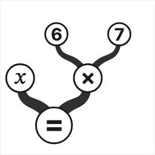
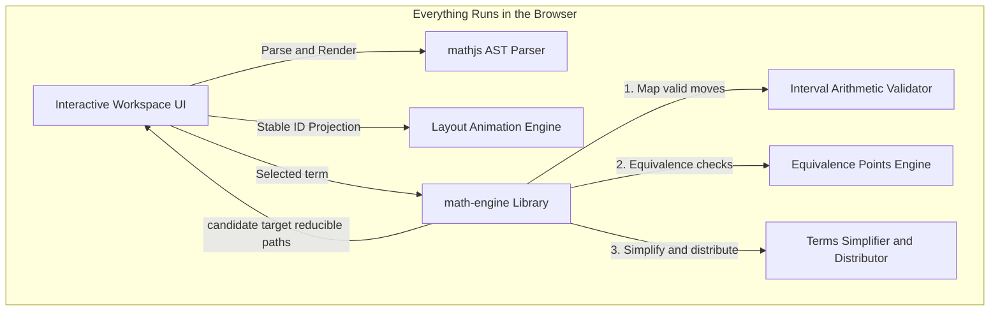

<p align="center">
  <picture>
    <source media="(prefers-color-scheme: dark)" srcset="ui/public/logo.png">
    
  </picture>
</p>

# Algebranch: Interactive Algebraic Derivation System

[](LICENSE)

Algebranch is an interactive tool for working through algebra one step at a time. Most math software is a black box: you type in a problem and it hands back the answer. Algebranch is the opposite: equations are laid out as movable pieces, and **you** drive every step, rearranging the equation yourself while Algebranch works out each move and keeps the math correct. It is free and open-source.

---

## 💡 Why Algebranch

The idea came from personal experience: as a dyslexic, I found the hardest part of math was rarely the ideas – it was keeping the symbols straight on the page. Building it became far easier when [*Interactive algebraic manipulation*](docs/shuffle.pdf), by Geoffrey Irving, supplied a key technical insight – and, with it, the nudge to finally build the thing.

---

## ✨ Key Features

*   **Guided, never automated**: Algebranch won't solve the problem for you. You make each move and see how the algebra unfolds.
*   **Mistake-proof**: Every move is checked; only the ones that keep the equation true are allowed.
*   **Branch and explore**: Go back to any earlier step and try a different route. Your work grows into a tree of alternatives rather than a single line.
*   **Algebraic identities**: Apply standard identities, such as factoring or expanding, with a click.
*   **Substitution**: Substitute a value for a variable, or collapse a complex expression into a single variable and expand it back later.
*   **Equation library**: Start from a built-in library of 80+ examples, spanning linear equations, quadratics, and factoring.

---

## 🧮 Using Algebranch

1.  **Select a term**: Click a term to select it. It highlights to show what will move.
2.  **Choose where it goes**: Valid destinations light up green. Click one to move the term there. Algebranch updates the rest of the equation, such as switching a plus to a minus when a term crosses the equals sign.
3.  **Simplify or expand**: Click the amber handles to simplify or expand a term.
4.  **Go back or branch**: Each step is saved on the history timeline. Click any earlier step to return to it or start a new branch from there.

**Deep links**: Add `?eq=<equation>` to the URL to open a specific starting equation, for example `?eq=x^2-9=0`. The in-app share button builds these links for you.

---

## ⚙️ Running Locally

Requires **Node.js 18+** and npm. It is an npm-workspaces monorepo, so run every command from the repo root. The dev server runs at [http://localhost:3000](http://localhost:3000).

```bash
npm install      # install all packages (root, ui, math-engine)
npm run dev      # start the dev server
npm test         # run the math-engine test suite
npm run build    # production build
```

---

## 🏗️ Architecture

Algebranch is a monorepo with two packages:



*   **`/math-engine`**: A portable TypeScript reasoning library with no DOM, React, or Next.js dependencies: the interval-arithmetic evaluator, identity tester, simplification and distribution rules, and AST serializers.
*   **`/ui`**: A Next.js frontend using Jotai for state, custom SVG canvases for the branching history timeline, and custom layout animations that slide terms smoothly to their new positions. It imports the math engine directly and runs all solving and validation in the browser (see SPEC §4.3).

> For the full architecture (data representation, validation, and execution model), see **[SPEC.md §2–§5](SPEC.md)**.

---

## 📄 License

Copyright (C) 2026 Robert Harris.

Algebranch is free software, licensed under the **GNU General Public License v3.0 or later** (`GPL-3.0-or-later`). You may redistribute and/or modify it under the terms of that license; it is distributed in the hope that it will be useful, but **without any warranty**. See the [`LICENSE`](LICENSE) file for the full text, or <https://www.gnu.org/licenses/gpl-3.0.html>.
